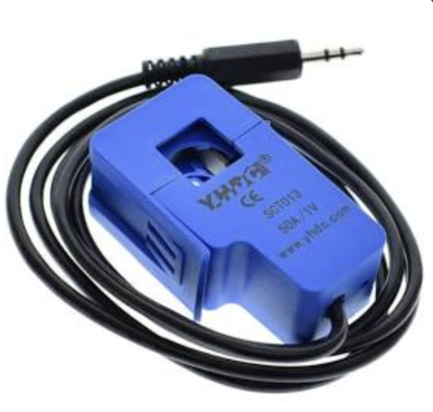
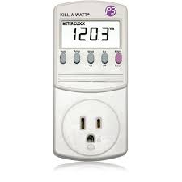
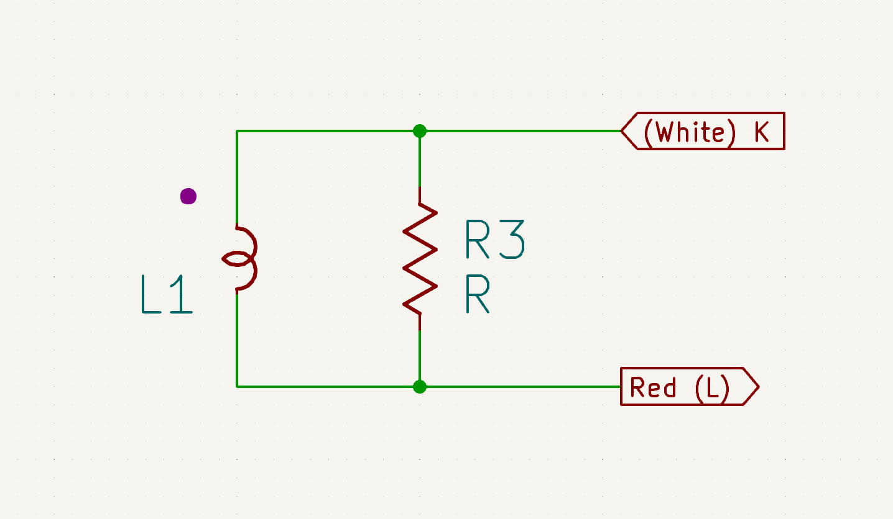
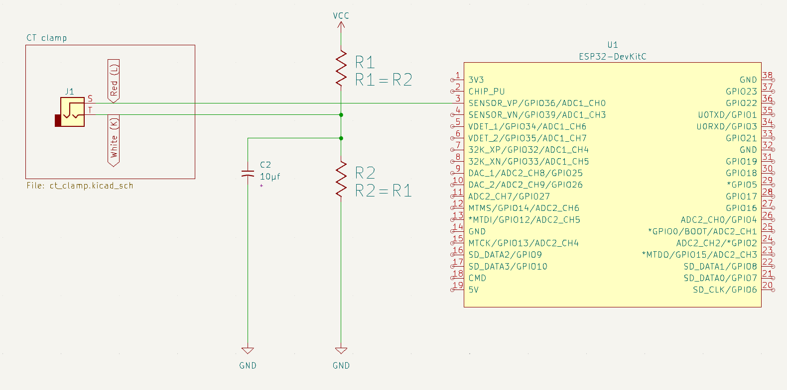

## Problem

My dryer is downstairs in my garage, and I cannot hear it when the cycle
completes. I want to move my dryer clothes out when they are done to avoid
wrinkling and needlessly delaying any loads waiting in the washer.

tl;dr [solution](#solution)

## Background

I don’t own the place I live in. I can’t change much in the appliances that came
with the house. I want something noninvasive that minimizes the chance of
bricking the appliance or burning down the house.

## Key Requirements

1. Reliable detection of when the dryer is done.
2. Notification on a remote device when the dryer is done.
3. No modifications to the dryer’s internals.

## Detecting When The Dryer Is Done

The dryer needs to spin a big motor and power a heating element hot enough to
dry clothes. I assume that when the dryer is running, it is drawing a large
amount of current, and when it is not running, it is drawing low or no current.
We now need a way to detect high/low current draw without modifying internal
circuitry.

## Detecting Current Draw

I found a couple of options available that at least fulfill requirements 1 and 3:

### [CT (Current Transformer) Clamp](https://en.wikipedia.org/w/index.php?title=Current_clamp&oldid=1133896436)

When current is running through the conductor, the current transformer provides a
proportional current in the secondary winding. A current transformer is a
split ring made of ferrite or soft iron. The conductor (wire) it is clamped
around forms the primary winding, and the wire coiled round the ferrite ring
forms the secondary winding.

In other words, by clamping the power cable we can measure the current being
drawn by the appliance and combine it with something that can report the reading
remotely.

### [Kill-A-Watt](https://en.wikipedia.org/w/index.php?title=Kill_A_Watt&oldid=1113113051)

Kill-A-Watt is an electricity usage monitoring device manufactured by Prodigit
Electronics that measures energy used by devices plugged directly into the
meter. It displays a number of metrics on its LCD screen, including current.

However, it does not report readings remotely.

## Reporting Current Draw Remotely

The system will be located at home. Since the laundry room likely does not have
a ethernet drop, we will want to connect wirelessly. Bluetooth, Zigbee, and
other protocols require a hub that speaks those protocols, which may not be
ubiquitous. Almost everyone has WiFi at home.

## Consuming Current Draw Data

Pictured is the schematic for an SCT013 Current Transformer clamp manufactured
by YHDC. Depending on the model, the CT clamp may include an internal burden
resistor $R_3$. If there is no internal burden resistor, one must be added to
your circuit across the $K$ and $L$ wires. The purpose of the internal burden
resistor is to protect the circuit and allow measuring of voltage across the
circuit, proportional to the current in the secondary winding of the
transformer.

Many wireless microcontrollers have a analog to digital converter (`ADC`) pin
that lets you measure voltage. By feeding the `ADC` pin the voltage over the
burden resistor, we can calculate the current in the primary winding.

### Calculating Current From Voltage

$$ I_s = I_p / N $$

Where $I_s$ is the current in Amps of the secondary winding, $I_p$ is the
current in Amps of the primary winding (the power cable), and $N$ is the number
of turns in the current transformer.

Measure the voltage across the burden resistor and apply Ohm’s law to get the
current:

$$ I_p = \frac{R_3}{NV} $$

However, SCT013 documentation does not include the number of turns, nor does it
include the internal burden resistor value. To work around this, we can measure
$V$ with the clamp on a wire plugged into a Kill-A-Watt, which provides $I_p$
value.

Using Ohm’s law, we get this formula to calculate the constant ratio $T$ between
$I_p$ and $V$:

$$ \frac{R_3}{N} = \frac{V}{I_p} = T $$

$T$ can then be used to obtain the current draw in the primary winding:

$$ I_p = \frac{T}{V} $$

## Solution

